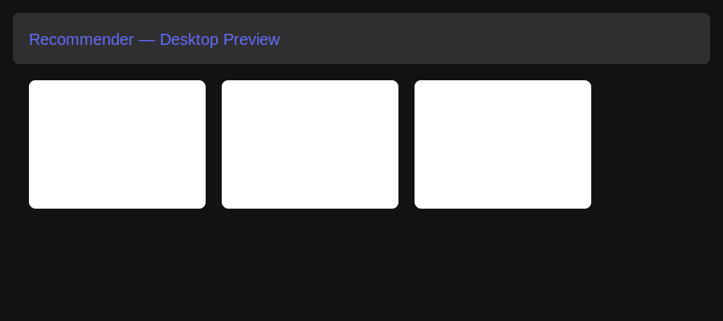
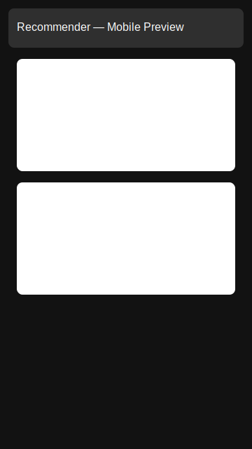

# feat(ui): UI improvements — responsive & accessible

This PR introduces a small design system and fixes to improve responsiveness, accessibility, and consistency.

## Summary of changes
- Add CSS tokens and responsive utilities in `frontend/src/index.css`
- Responsive Navbar with accessible toggle (`frontend/src/components/Navbar.jsx`)
- Product card improvements: aspect-ratio images, lazy loading, accessible like button (`frontend/src/components/ProductCard.jsx`)
- Admin panel styling (`frontend/src/pages/AdminPanel.jsx`)
- Add `frontend/STYLEGUIDE.md` and placeholder screenshots (`frontend/screenshots/`)

## Checklist
- [x] CSS variables and tokens defined
- [x] Responsive navbar (mobile toggle)
- [x] Accessible interactive elements (aria, focus-visible)
- [x] Product images use `loading="lazy"` and consistent aspect ratio
- [ ] Product detail layout adjusted for small screens (next)
- [ ] Review UI and forms improved for mobile (next)
- [ ] Run accessibility audit and fix contrast issues (next)

## Preview
Desktop:

Mobile:

---

Notes: I pushed branch `feat/ui-improvements`. You can create the PR quickly here:
https://github.com/ateebarman/RecoSense/pull/new/feat/ui-improvements
