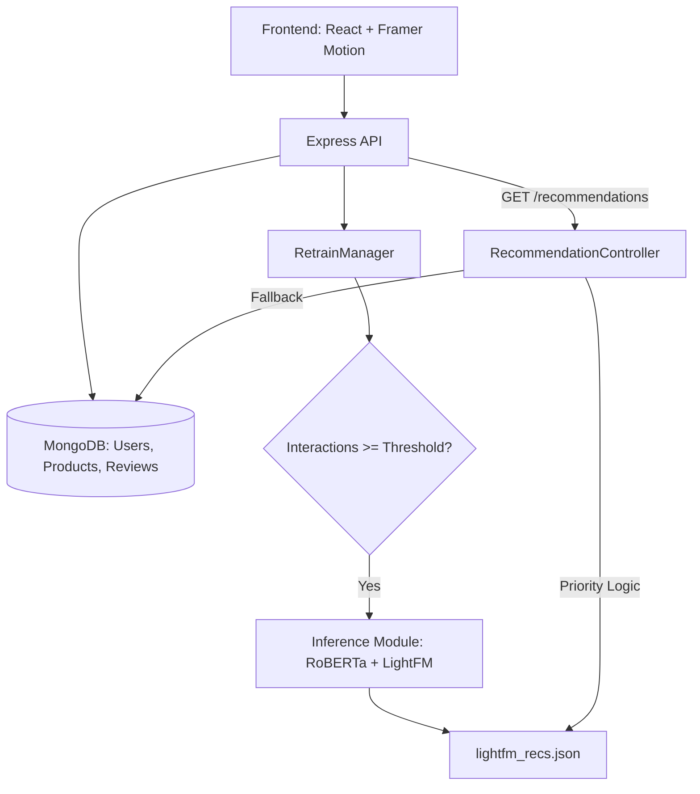

# RecoSense 🚀

### *Find Exactly What You'll Love Tomorrow*

RecoSense is a premium, full-stack e-commerce marketplace powered by an advanced hybrid analytical engine. It transforms traditional shopping into an intelligent discovery journey using **RoBERTa-based sentiment analysis** and **LightFM hybrid filtering** models.

---

## 🌟 Key Features

### 🧠 Analytical Discovery (Smart Picks)
*   **Hybrid Recommendation Engine:** Leverages **LightFM** to combine collaborative filtering with content-based metadata for high-precision suggestions.
*   **Sentiment Awareness:** Integrates **RoBERTa (Robustly Optimized BERT Pretraining Approach)** to analyze review semantics and extract deep qualitative insights.
*   **Smart Cold-Start:** New users receive high-accuracy suggestions based on demographic profiling (age group and gender).
*   **Counter-Based Auto-Triggering:** Analytical models automatically recompute recommendations in the background as user interactions accumulate.

### 🎨 Premium User Experience
*   **Cinematic Landing Page:** A high-impact, professional entrance featuring motion-driven storytelling and deep-learning insights.
*   **Fluid Animations:** Powered by `framer-motion` for a smooth, high-end feel throughout the application.
*   **Glassmorphism UI:** Modern dark-theme aesthetic with vibrant accents and frosted-glass navigation.

### 🛒 Core Marketplace Features
*   **Unified Product Catalog:** Browse thousands of devices with high-detail cards and instant action buttons.
*   **Real-time Wishlist:** Save items you love and track them in a dedicated favorites dashboard.
*   **Activity Feed:** View and manage your product reviews, enriched by sentiment-aware processing.
*   **Secure Authentication:** JWT-based secure login and registration with demographic profiling.

### ⚙️ Engine Control Center
*   **Model Monitoring:** Track interaction counters and model run statuses in real-time.
*   **Manual Overrides:** Admins can manually trigger model recomputations or clean recommendation sets.
*   **Detailed Analytics:** System-level logs for both Node.js and Python-based execution paths.

---

## 🛠️ Tech Stack

| Layer | Technologies |
|---|---|
| **Frontend** | React, `framer-motion`, `lucide-react`, Axios, React Router |
| **Backend** | Node.js, Express, MongoDB (Mongoose) |
| **Analytical Engine** | **LightFM** (Hybrid Filtering), **RoBERTa** (Transformers for Sentiment) |
| **Styling** | Vanilla CSS (Modern Design System with Global Tokens) |
| **State** | React Context (User & Cart Management) |

---

## 🏗️ Architecture



---

## 🚀 Quick Start

### Prerequisites
*   **Node.js** (v18+)
*   **MongoDB** (Local instance or Atlas)
*   **Python 3.8+** (For LightFM/RoBERTa modules)

### 1. Clone & Install
```bash
git clone https://github.com/your-username/RecoSense.git
cd RecoSense

# Install Backend
cd backend
npm install

# Install Frontend
cd ../frontend
npm install
```

### 2. Configure Environment
Create a `.env` file in the `backend/` directory:
```env
MONGO_URI=mongodb://localhost:27017/recom-db
PORT=5001
JWT_SECRET=your_super_secret_key
MODEL_RUN_THRESHOLD=10
```

### 3. Seed & Run
```bash
# In backend directory
npm run seed      # Initialize test data
npm start         # Start API server

# In frontend directory
npm run dev       # Start Vite dev server
```

---

## 📄 Documentation

For deep technical dives into the model architecture, see:
*   [Recommendation System Guide](./RECOMMENDATION_SYSTEM.md)
*   [Deployment Guide](./DEPLOY.md)

---

Generated by **RecoSense Engineering**. Empowering the future of personalized commerce. ✨
