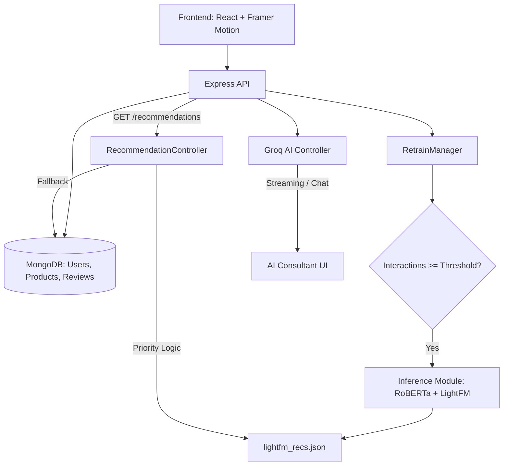

# RecoSense 🚀

### *Find Exactly What You'll Love Tomorrow*

RecoSense is a premium, full-stack e-commerce marketplace powered by an advanced hybrid analytical engine. It transforms traditional shopping into an intelligent discovery journey using **RoBERTa-based sentiment analysis**, **LightFM hybrid filtering**, and a high-performance **Groq-powered AI Consultant**.

---

## 🌟 Key Features

### 🧠 Intelligence & Analytical Discovery
*   **AI Consultant (Groq API):** A specialized LLM-powered consultant (Llama 3 family via Groq) that provides real-time, context-aware technical advice, product comparisons, and personalized discovery paths.
*   **Hybrid Recommendation Engine:** Leverages **LightFM** to combine collaborative filtering with content-based metadata for high-precision suggestions.
*   **Sentiment Awareness:** Integrates **RoBERTa (Robustly Optimized BERT Pretraining Approach)** to analyze review semantics and extract deep qualitative insights.
*   **Smart Cold-Start:** New users receive high-accuracy suggestions based on demographic profiling (age group and gender).
*   **Auto-Triggered Re-training:** Analytical models automatically recompute recommendations as user interactions accumulate, ensuring a perpetually fresh discovery feed.

### 🎨 Premium User Experience
*   **Cinematic Design System:** Modern dark-theme aesthetic featuring glassmorphism, fluid animations (Framer Motion), and a high-impact discovery-driven landing page.
*   **Symmetrical UI:** Optimized Product Detail layouts with perfect visual alignment between imagery and technical specifications.
*   **Fluid Navigation:** Enhanced UX with automatic **Scroll-to-Top** behavior on route changes and a consistent, globally-integrated footer.
*   **Optimized Performance:** Implemented **bulk-fetch API endpoints** and a **Synchronized Global State** (UserContext) to ensure zero-latency UI updates and preference persistence.

### 🛒 Core Marketplace Features
*   **Unified Product Catalog:** Browse thousands of electronics with high-detail cards and instant save-to-wishlist functionality.
*   **Smart Wishlist Dash:** A centralized hub to track your favorited tech, synced in real-time across all devices.
*   **Activity & Reviews:** Manage your community-contributed reviews, processed via sentiment-aware backend pipelines.
*   **Identity Management:** Secure JWT-based authentication with role-based access for an administrative inventory dashboard.

---

## 🛠️ Tech Stack

| Layer | Technologies |
|---|---|
| **AI / ML** | **Groq API** (Llama 3), **LightFM** (Hybrid Filtering), **RoBERTa** (Transformers) |
| **Frontend** | React, `framer-motion`, `lucide-react`, React Router, Axios |
| **Backend** | Node.js, Express, MongoDB (Mongoose) |
| **Styling** | Vanilla CSS (Modern Design System with Global Tokens) |
| **State** | React Context (Synchronized Global Wishlist & User State) |

---

## 🏗️ Architecture



---

## 🚀 Quick Start

### Prerequisites
*   **Node.js** (v18+)
*   **MongoDB** (Local instance or Atlas)
*   **Python 3.8+** (For LightFM/RoBERTa modules)
*   **Groq API Key** (For the AI Consultant feature)

### 1. Clone & Install
```bash
git clone https://github.com/ateebarman/RecoSense.git
cd RecoSense

# Install Backend
cd backend
npm install

# Install Frontend
cd ../frontend
npm install
```

### 2. Configure Environment
Create a `.env` file in the `backend/` directory:
```env
MONGO_URI=your_mongodb_uri
PORT=5001
JWT_SECRET=your_super_secret_key
GROQ_API_KEY=your_groq_api_key
MODEL_RUN_THRESHOLD=10
```

### 3. Seed & Run
```bash
# In backend directory
npm run seed      # Initialize test data
npm run dev       # Start API server

# In frontend directory
npm run dev       # Start Vite dev server
```

---

## 📄 Documentation

For deep technical dives into the model architecture, see:
*   [Recommendation System Guide](./RECOMMENDATION_SYSTEM.md)
*   [Quick Re-run Engine (Level 1)](./QUICK_RE_RUN.md)
*   [LightFM Heavy Retrain (Level 2)](./LIGHTFM_RETRAIN.md)
*   [Deployment Guide](./DEPLOY.md)

---

## 🛠️ Manual Engine Triggers (CLI)

If you need to run the engine manually without using the Admin Panel:

### 1. Quick Re-run (Node.js)
```bash
node -e "require('./recommender/retrainManager').startModelRun()"
```

### 2. Heavy Retrain (Python LightFM)
```bash
node -e "require('./recommender/retrainManager').startRetrain()"
```

---

Generated by **RecoSense Engineering**. Empowering the future of personalized tech discovery. ✨
